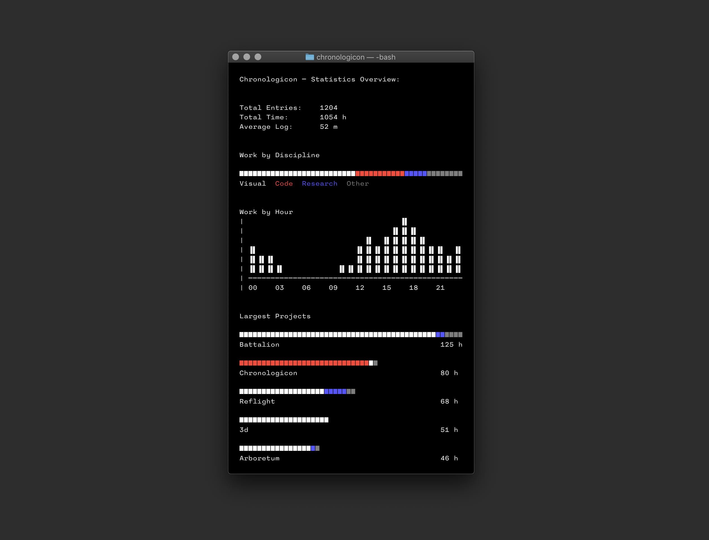

# Chronologicon
v5.1 — 181123

A minimal time tracker, now rewritten for the command line. Chronologicon records your work sessions and displays graphs based on your projects.

Install:
`$ pip install chronologicon`

&nbsp;





## Logs
Chronologicon stores work sessions as *logs.* Each log has a named *discipline* and *project,* along with an optional note. The project should be self-explanatory; the discipline refers to the general type of work. I separate mine into *visual, code,* and *research*, but you should use whichever categories feel most suited to your workflow.

The note is optional, but may be useful to you for recording the specific task you're working on.

A list of all logs is saved in `logs.json`, in Chronologicon's save directory. This file can (and should) be backed up with the `$ chron backup` command.

`stat.json` contains a more lightweight summary of these log data, which is used to display the graphs. It's overwritten every time you complete a log.


## Commands

```
start <args>      Start a new log timer
stop              Complete the current log
status            Check whether a log is in progress
cancel            Abort the current entry
stats <args>      View stats & graphs
backup            Backup the log data file
list              Show the 10 most recent logs
edit <args>       Edit an attribute of a specific log
remove <id>       Remove a specific log
directory <dir>   Change the save directory
```

The first time you use Chronologicon, you'll need to specify a save directory with the `directory` command.


## Example Usage

`$ chron directory ~/Documents/Chron` Change the save directory to a folder on your computer.

`$ chron start 'discipline' 'project' 'note'`
Create a new log with discipline, project, and (optionally) a note.

`$ chron stop`
Stop tracking and save the current log.


## Stats

`$ chron stats` has optional arguments:

```
verbose      Show additional projects
uniform      Display project graphs as full width
refresh      Force recalculate stats
```

Example usage:

`$ chron stats uniform verbose`

`$ chron stats refresh`


## Synonyms

Some commands have synonyms, which you can use if you prefer. Some are actual synonyms, others are shortcuts or legacy commands:

```
start       s, -s, begin
stop        x, -x, end
cancel      abort
list        ls
remove      rm, delete, del
stats       v, -v, graphs
backup      b, -b
directory   d, -d
```


## Editing

> __Warning!__
> Edition and removal of previous logs is a new and largely untested feature.  
> Make sure your logs file is backed up.

- __Listing entries__:
- `$ chron list`: view the IDs of your 10 most recent logs.
- `$ chron list verbose`: view the ID of every log.
- __Modifying attributes__:
- `$ chron edit <logID> <attribute> <newValue>`
- Example: `$ chron edit 204 discipline 'music'`
- __Removing entries__:
- `$ chron remove <logID>`
- Example: `$ chron remove 42`
